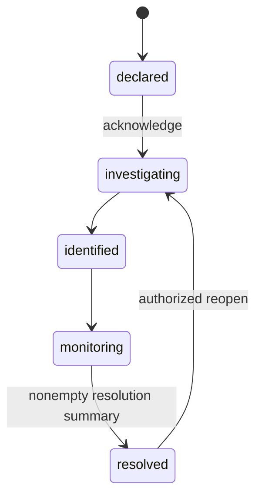

# Incident API and response lifecycle

All routes begin `/api/workspaces/:workspaceId`. Every route requires a valid cookie/bearer session and active membership in that workspace. IDs are validated 24-character ObjectIds; runbook step IDs and operation IDs are UUIDs. Foreign resources and assignments must belong to the same workspace; assigned users must be active. Deleted/disabled memberships and suspended users cannot participate.

## Routes

| Method | Path | Purpose |
| --- | --- | --- |
| GET / POST | `/incidents` | Filtered list / declare |
| GET | `/incidents/:incidentId` | Detail including runbook snapshots |
| PATCH | `/incidents/:incidentId` | `edit` command only |
| POST | `/incidents/:incidentId/actions` | Validated command below |
| GET | `/incidents/:incidentId/timeline` | Chronological append-only history |
| GET | `/incidents/:incidentId/presence` | Active authorized viewers, names/IDs only |
| GET | `/incidents/metrics` | Server aggregation facets |
| GET | `/incidents/references?page=1` | Paginated workspace project/task choices, 100 each |
| GET / POST | `/runbooks` | List / create source runbook |
| PUT | `/runbooks/:runbookId` | Replace permitted source fields |
| POST | `/runbooks/:runbookId/archive` | Soft archive source |

Lists use `page` (1+) and `limit` (1-100; incidents default 20, timeline/runbooks 50). Incident filters: `status`, `severity`, `commanderId`, `responderId`, `from`, `to` (ISO UTC declaration timestamps), `archived=true|false` (default false), `q` (literal title search, max 100). Unknown fields and reversed date ranges return 400. Lists return `{items, pagination: {page, limit, total, pages}}`. Runbook lists optionally filter `status=draft|active|archived`. Metrics accept incident filters; page/limit do not truncate aggregates.

Declaration body: `{operationId, title, summary, impact, severity, commanderId?, responderIds?, linkedProjectIds?, linkedTaskIds?, confirmSev1?}`. Title is required (max 200); summary/impact are strings up to 4000. Severity is `sev1|sev2|sev3|sev4`; sev1 requires `confirmSev1: true`. A member may declare without assignments; only owner/admin can supply the initial commander/responders. Successful creation returns 201 `{incident}`.

All actions use `{operationId: UUID, command: {...}}` and return `{incident}`. Reuse the exact same validated body, actor, target and operation UUID when retrying; do not reuse an operation UUID for a different action. Duplicate successful requests return the incident's current representation without repeating timeline/notification creation or socket emissions. Conflicting UUID reuse returns 409. A 503 may mean the commit result was unavailable: retry the original request to recover it. The UI's retry buttons preserve request variables; editing a failed declaration starts a different operation, so first reconcile an ambiguous result.

| command.action | Additional fields | Permission |
| --- | --- | --- |
| `edit` | `fields: {title?, summary?, impact?, severity?}` | Commander or owner/admin |
| `acknowledge` | none | Commander or owner/admin |
| `transition` | `status`, `resolutionSummary?` | Commander or owner/admin |
| `commander` | `userId` or null | Commander or owner/admin |
| `responders` | `userIds: []` replaces team | Commander or owner/admin |
| `links` | `projectIds: [], taskIds: []` replaces links | Commander or owner/admin |
| `timeline` | `message`, optional `mentionIds: []` | Any active member |
| `archive` | none; requires resolved | Owner/admin |
| `attach-runbook` | `runbookId` of active source | Commander or owner/admin |
| `step` | `runbookId`, `stepId`, `completed: boolean` | Commander, responder or owner/admin |

Arrays accept up to 100 unique identifiers. Empty arrays remove assignments/links; null removes commander. Incident editing cannot change workspace, status, timestamps, declared actor, archived flag, history or embedded progress. Archive is soft, requires resolved, and makes subsequent commands read-only; repeated archive itself is safe. There is no incident/timeline DELETE endpoint. Repeating an acknowledgement/target status never resets timestamps. A different operation UUID may record another harmless command receipt; use the original UUID for exact retry deduplication.

## State machine

Other edges return 409. The first transition to investigating sets `acknowledgedAt`; repeated acknowledgement and reopen preserve it. Resolution sets `resolvedAt` and requires a trimmed nonempty summary. Reopen clears current resolution time/summary, retaining the historical transition entry. Every committed state change has a timeline entry. All timestamps are UTC; clients explicitly display UTC.

Runbook bodies are `{name, description, ownerId, status, steps: [{id: UUID, title, instructions, position}]}`. IDs and positions must be unique, with up to 100 steps. Source create/edit/archive requires owner/admin; source ownership alone does not grant administrative privileges. Attachment snapshots source name/instructions/steps once. Completion/reopening affects only that incident's snapshot, even if the source changes or is archived.

## Notifications and realtime

High-severity declarations/severity changes notify active workspace administrators and the response team. Assignment, status, resolution/reopen and progress changes notify the current response team; timeline updates with explicit mentions notify those active mentioned members, otherwise the response team. Actors are excluded; the transaction's unique workspace/operation/recipient index prevents retry duplicates. Notification titles use only the incident number and a generic response message. REST notification queries remain recipient-scoped.

Typed events: `incident.declared`, `incident.updated`, `incident.severity_changed`, `incident.status_changed`, `incident.commander_changed`, `incident.responder_changed`, `incident.timeline_added`, `incident.runbook_attached`, `incident.step_completed`, `incident.resolved`, `incident.reopened`. Lifecycle/assignment events use the workspace room; timeline/runbook events use the incident room. `incident:join` / `incident:leave` take a validated incident ID and return the shared acknowledgement format. Joining requires server-side active workspace authorization. Private `notification.created` hints go exclusively to `workspace:{workspaceId}:user:{recipientId}`. No narrative, instructions, socket IDs, instance IDs, tokens or connection metadata are broadcast.

Durable writes do not depend on best-effort application event delivery. Redis outages fail sockets closed while committed REST state remains available. Reconnect restores subscriptions and reloads data; periodic polling catches missed hints and lease expiry. Horizontal scaling still requires Redis on all API processes.

## Metrics and tests

`openBySeverity` counts non-resolved incidents. `averages` includes `meanAcknowledgeMs`, `acknowledgedCount`, `meanResolveMs`, `resolvedCount`. Missing timestamps are excluded from both sample count and average; zero samples produce null, not zero. Reopening excludes an incident from MTTR until it resolves again. Daily `createdOverTime` / `resolvedOverTime` arrays use UTC date `_id` and `count`. Filters select a declaration cohort, including archive selection; resolved daily counts describe current resolution times, not every historical resolution event.

The API starts only on MongoDB replica-set/sharded topology with required indexes ready. Tests use `MongoMemoryReplSet`, preserving real transaction behavior without external infrastructure. Integration tests force failures after incident/timeline writes, exercise concurrent numbering/receipts, active-member boundaries, snapshots, aggregation, private sockets, membership eviction and recovery. Frontend tests cover sev1 confirmation, exact-request retry, resolution confirmation, keyboard-operable step reordering and listener deduplication.
